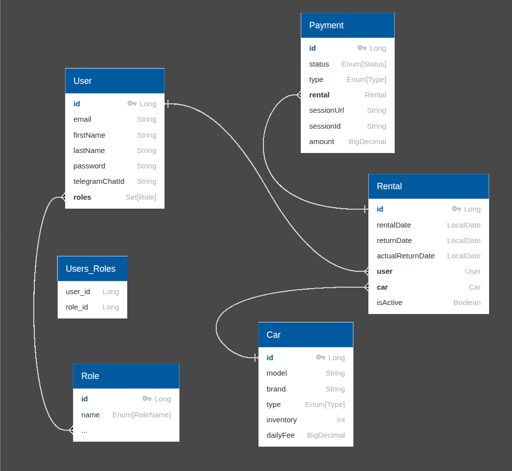

# 🚗 Car Sharing Service

Car Sharing Service is a backend system designed to support a modern, scalable, and secure car sharing platform.
Built with Java and the Spring Boot framework, this project provides a robust foundation for managing vehicle 
rentals, user authentication, payment processing, and real-time notifications.

---

## Table of contents

[Key Technologies](#key-technologies)

[Architecture Overview](#architecture-overview)

[List of Controllers](#list-of-controllers)

[Database Schema Relationship Diagram](#database-schema-relationship-diagram)

[How to Launch a Spring Boot Application with Maven or Docker](#how-to-launch-a-spring-boot-application-with-maven-or-docker)

---

## Key Technologies

- Java 17 – Primary programming language used for backend development.

- Maven – Dependency and build management tool for Java projects.

- Spring Boot 3.3.2 – Enables rapid application development with embedded server support and production-ready 
configurations.

- Spring Security 6.3.1 – Handles authentication and authorization with integrated JWT support.

- Spring Data JPA 3.3.2 (Hibernate 6.5.2.Final) – Simplifies database operations with powerful object-relational
mapping.

- MapStruct 1.5.5.Final – Efficient DTO-to-entity and entity-to-DTO mapping.

- Liquibase 4.27.0 – Manages database schema changes with version control and automated tracking.

- MySQL 8.0.33 – Reliable relational database used for persistent data storage.

- Lombok 1.18.34 – Reduces boilerplate code through annotations.

- Swagger (OpenAPI) – Provides interactive and automatically generated API documentation.

- Postman – Used for API testing, validation, and development workflows.

- Docker – Ensures consistent deployment across environments via containerization.

- Stripe 29.1.0 – Integrated payment gateway for secure and seamless transactions.

- Telegram Notifications 6.9.0 – Sends real-time updates and notifications via Telegram bots.

[Table of contents](#table-of-contents)

---

## Architecture Overview

This project adopts a Layered Architecture that ensures clean separation of responsibilities and promotes
maintainability, testability, and scalability.

**Controller Layer**
- Exposes RESTful API endpoints.

- Handles HTTP requests and responses.

- Delegates business logic to the service layer.

**Service Layer**

- Contains core business logic.

- Coordinates between controllers, repositories, and external services (e.g., payment, notifications).

- Ensures validation and business rule enforcement.

**Repository Layer**

- Manages data persistence and access using Spring Data JPA.

- Interaction with the MySQL database.

- Use custom queries when needed for complex data access logic.

**Model Layer**

- Defines domain entities representing database tables.

- Includes DTOs (Data Transfer Objects) to encapsulate and transport data between layers in a secure and 
efficient manner.

**Mapper Layer**

- Use MapStruct to automatically convert between entities and DTOs.

- Helps keep the service and controller layers clean.

**Security Layer**

- Implements JWT-based authentication and role-based access control.

- Manage login, token issuance, and authorization rules via Spring Security.

**Notification Layer**

- Sends real-time Telegram notifications for key events (e.g., rental the cat, payment status).

**Payment Integration**

- Integrates with Stripe for secure, reliable online payments.

[Table of contents](#table-of-contents)

---

## List of Controllers
The Car Sharing Service is built on a RESTful architecture, offering a modular and scalable backend.
The system exposes multiple endpoints grouped under specific controller modules, each responsible for 
a distinct set of functionalities.

**AuthenticationController**

- **POST:** `/registration` - Register new users (with role CUSTOMER).
- **POST:** `/login` - Authenticate existing users with JWT.

**CarController**

- **POST** `/cars` - Save a new car (only for role MANAGER).
- **GET** `/cars` - View list of all cars.
- **GET** `/cars/{id}` - View all car information by id.
- **PUT** `/cars/{id}` - You can change any parameter in the car (only for role MANAGER).
- **PATCH** `/cars/{id}` - Update a car invention by id (only for role MANAGER).
- **DELETE** `/cars/{id}` - Mark as delete the car by id (only for role MANAGER).

**PaymentController**

- **POST** `/payments/create` - Create a session to payment rental.
- **GET** `/payments/{paymentId}` - View the payment by id (only for role MANAGER).
- **GET** `/payments` - View all user`s payments.
- **GET** `/payments/success` - View if the payment was success.
- **GET** `/payments/cancel` - View if the payment was cancel.

**RentalController**

- **POST** `/rentals` - Create a new rental.
- **GET** `/rentals/{rentalId}` - View user`s rental by id.
- **POST** `/rentals/{rentalId}/return` - Close the rental by id.
- **GET** `/rentals/active` - View the list of rentals active or inactive (only for role MANAGER).

**UserController**

- **GET** `/users/all` - View list of all users (only for role MANAGER).
- **PUT** `/users/{id}/role` - Update user's role (only for role MANAGER).
- **GET** `/users/me` - View user`s information.
- **PUT** `/users/me` - Update user`s personal information.
- **PATCH** `/users/me` - Update user`s password.

[Table of contents](#table-of-contents)

---

## Database Schema Relationship Diagram



[Table of contents](#table-of-contents)

---

### How to Launch a Spring Boot Application with Maven or Docker

Before running the application, ensure the following tools are installed and available:
- Java (21 or compatible)
```
java -version
```
- Maven (3.8+ recommended)
```
mvn -version
```
- Docker
```
docker --version
```
Open the Terminal
- Open a terminal or command prompt on your computer

Navigate to the Project Folder
- Use the cd command to move into the folder that contains your Spring Boot project (the folder with the pom.xml file):
```
cd path/to/your/project
```
*Example:*
```
cd ~/Documents/carsharing
```

Before running the project, create .env a file in the root directory with the required credentials

*Example:*
```
MYSQLDB_USER=your_data
MYSQLDB_ROOT_PASSWORD=your_data
MYSQLDB_DATABASE=your_data
MYSQLDB_LOCAL_PORT=your_data
MYSQLDB_DOCKER_PORT=your_data
SPRING_LOCAL_PORT=your_data
SPRING_DOCKER_PORT=your_data
DEBUG_PORT=your_data
JWT_EXPIRATION=your_data
JWT_SECRET=your_data
STRIPE_SECRET_KEY=your_data
PAYMENT_SUCCESS_URL=your_data
PAYMENT_CANCEL_URL=your_data
TELEGRAM_BOT_TOKEN=your_data
```

Run the Application Using Maven
- Use the following command to launch the Spring Boot application:
```
mvn spring-boot:run
```
Verify the Application is Running
- If successful, you will see logs ending with something like:
```
Started BookstoreApplication in X.XXX seconds (process running for X.XXX)
```

**Or using Docker to run app**

- Build Docker image
```
docker build -t carsharing-app:1.0 .
```

- Run the container
```
docker run -p 8088:8080 carsharing-app:1.0
```

Now that Spring Boot application is running, you can use Postman (or any other REST client) to test its API endpoints.

[Table of contents](#table-of-contents)

---
